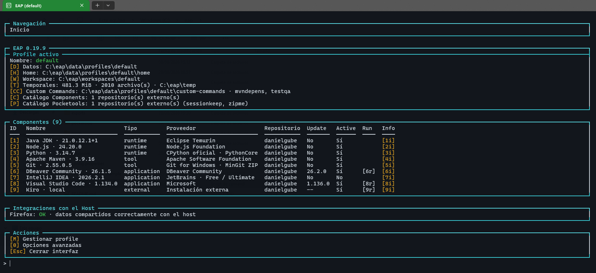
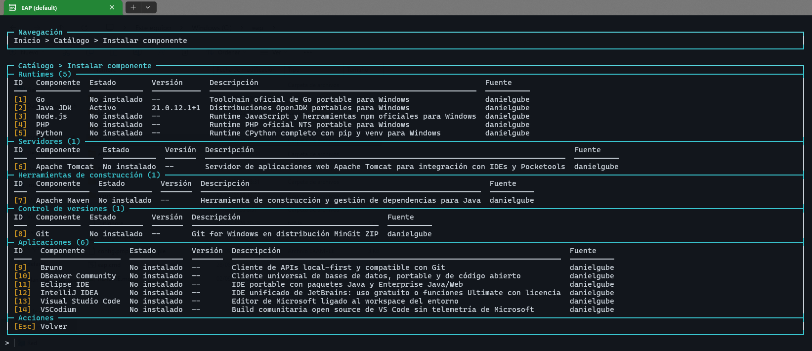
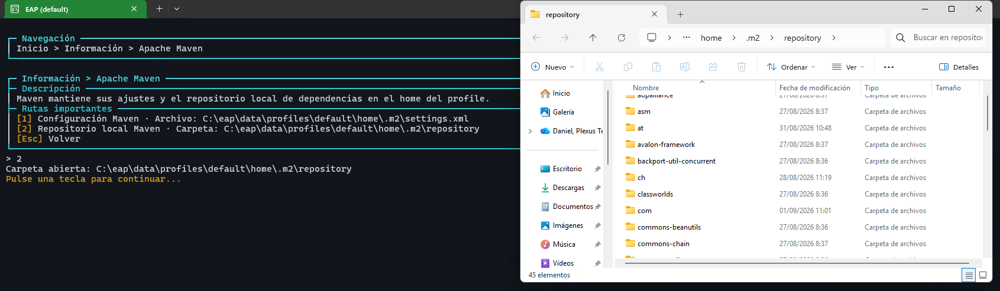

<h1 align="center">EAP</h1>

<h3 align="center">Tu entorno de desarrollo cabe en una carpeta.</h3>

<p align="center">
  <strong>Generador de entornos productivos, portátiles y reproducibles para Windows.</strong><br>
  Components versionados, Pocketools globales y todos los profiles que necesites.<br>
  Sin contaminar el sistema. Sin pelearte con el <code>PATH</code>. Sin reconstruir tu equipo a mano.
</p>

<p align="center">
  <a href="https://github.com/danielgube/eap/releases/latest"></a>
  
  <a href="https://github.com/danielgube/eap/stargazers"></a>
</p>



*Dashboard del profile activo: componentes, integraciones y accesos directos a
sus datos, home y workspace.*

## Una carpeta. Cualquier proyecto. El entorno exacto.

EAP convierte una carpeta en un puesto de desarrollo completo. Cada **profile**
combina versiones concretas de herramientas, un workspace y datos portátiles.
Cambiar de proyecto es cambiar de profile; el resto lo reconstruye EAP.

- **Components** — runtimes y aplicaciones grandes, inmutables y compartidos:
  Java, Maven, Git, Node.js, Python, Go, PHP, Bruno, DBeaver, VS Code, Eclipse,
  IntelliJ IDEA y más.
- **Pocketools** — utilidades pequeñas y globales que publican sus propios
  comandos: automatizaciones, helpers de confianza TLS, empaquetado de código y
  cualquier herramienta que merezca estar siempre a mano.
- **Profiles** — selecciones reproducibles con lock, workspace, configuración
  privada, datos de usuario aislados y comandos personalizados.

Cada profile de datos incluye `custom-commands`. EAP crea la carpeta y la añade
al `PATH` de sus procesos, pero no instala ni modifica su contenido. Los scripts
`.cmd`, `.bat`, `.ps1` y los ejecutables que coloques allí quedan disponibles
sólo para los profiles que compartan esos datos. Las exportaciones individuales
pueden incluirlos de forma explícita; la exportación masiva siempre los excluye.
El contenido del workspace nunca se incluye al exportar un profile: al importarlo,
EAP conserva el workspace local existente o crea solamente su carpeta vacía.

Todo lo que EAP administra vive dentro de su directorio. Las variables se
inyectan únicamente en terminales y aplicaciones hijas: el registro y el entorno
global de Windows permanecen intactos.

## Lo que cambia al usar EAP

| Antes | Con EAP |
|---|---|
| Instalar y actualizar cada herramienta a mano | Explorar un catálogo y elegir versión o track |
| Un único Java, Node o Python para todo | Un profile exacto para cada proyecto |
| Modificar el `PATH` global y esperar que nada se rompa | Activación aislada por proceso |
| Duplicar instalaciones para separar proyectos | Payloads inmutables compartidos entre profiles |
| Documentar el onboarding en veinte pasos | Compartir una distribución o un paquete de profile |



*Catálogo navegable con categoría, estado, versión, descripción y repositorio de
cada Component.*

## Multirrepositorio de verdad

EAP no tiene un catálogo cerrado dentro del motor. **Components y Pocketools
pueden proceder de tantos repositorios HTTPS como necesites**:

```text
Repos de Components ──> catálogos validados ──> payloads compartidos ──> profiles

Repos de Pocketools ──> índices validados ──> comandos globales ───────> shells
```

Cada fuente conserva su identidad. EAP fija revisiones, valida manifiestos y
artefactos, comprueba hashes y publica las instalaciones de forma transaccional.
Puedes combinar el catálogo público con repositorios de equipo sin acoplarlos al
core:

```properties
components.repository.danielgube=https://github.com/danielgube/eap-components
components.repository.mi-equipo=https://github.com/mi-equipo/eap-components

pocketools.repository.danielgube=https://github.com/danielgube/eap-pocketools
pocketools.repository.mi-equipo=https://github.com/mi-equipo/eap-pocketools
```

Los catálogos iniciales viven en
[eap-components](https://github.com/danielgube/eap-components) y
[eap-pocketools](https://github.com/danielgube/eap-pocketools).



*Información y rutas importantes de cada Component, accesibles directamente
desde EAP.*

## Empieza en tres pasos

1. Descarga la [última release](https://github.com/danielgube/eap/releases/latest)
   o clona el repositorio.
2. Descomprime EAP en una ruta con permisos de escritura, por ejemplo `C:\eap`.
3. Ejecuta:

```bat
C:\eap\eap.cmd
```

En el primer arranque, EAP muestra lo que necesita y pide permiso antes de
descargar y verificar su core privado y portable. **No necesitas tener Python,
Java ni Node.js instalados previamente.**

Si prefieres empezar desde Git:

```bat
git clone https://github.com/danielgube/eap.git C:\eap
C:\eap\eap.cmd
```

## También es una CLI

La interfaz está pensada para descubrir y gestionar el entorno; la CLI permite
automatizar exactamente los mismos flujos:

```bat
eap doctor
eap profile create desarrollo --workspace mi-proyecto
eap component install java --provider temurin --track 21 --profile desarrollo --yes
eap component install nodejs --track 24 --profile desarrollo --yes
eap pocketool install zipme --yes
eap terminal start --profile desarrollo
```

Puedes exportar profiles, crear distribuciones completas con Components
incluidos, restaurar payloads desde locks, lanzar aplicaciones con sus datos
portátiles y trabajar detrás de proxies o certificados corporativos.

## Diseñado para trabajar, no para hacer una demo

- Descargas HTTPS y verificación SHA-256/SHA-512.
- Extracción segura e instalaciones transaccionales.
- Versiones exactas por profile, sin saltos mayores inesperados.
- Windows Terminal portable y runtime CPython privado.
- Diagnóstico, actualización y recuperación integrados.
- Configuración general y privada sin filtrar secretos a locks o diagnósticos.

## ¿Te ahorra una tarde de setup?

Entonces ya está haciendo su trabajo. Prueba EAP, cuéntanos qué entorno te
gustaría construir y deja una ⭐ para ayudar a que más desarrolladores de Windows
lo encuentren.

<p align="center">
  <a href="https://github.com/danielgube/eap/releases/latest"><strong>Descargar EAP</strong></a>
  ·
  <a href="https://github.com/danielgube/eap/issues"><strong>Proponer una mejora</strong></a>
  ·
  <a href="https://github.com/danielgube/eap/stargazers"><strong>Dar una estrella</strong></a>
</p>
